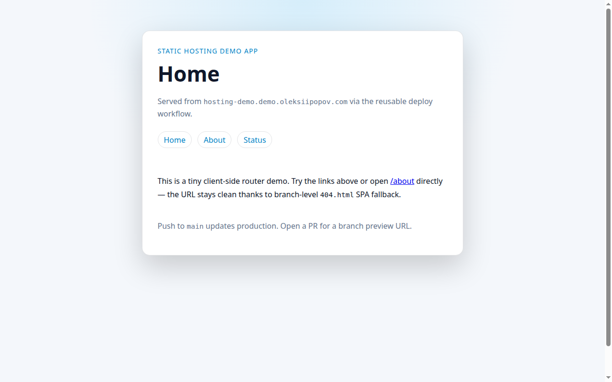

# Static Hosting Demo App

Minimal static SPA that consumes the [static-hosting-for-vibe-coders](https://github.com/AlexeyPopovUA/static-hosting-for-vibe-coders) platform. It builds with `pnpm`, deploys through reusable GitHub Actions workflows (`deploy-app.yml` / `cleanup-branch.yml`), and serves from a shared S3 bucket behind one CloudFront distribution — production on `main`, branch previews on pull requests.

**Read the write-up:** [Static hosting for vibe coders: one platform, many demo apps](https://oleksiipopov.com/blog/static-hosting-for-vibe-coders/) — architecture, requirements, and how external app repos plug in.

[](https://hosting-demo.demo.oleksiipopov.com)

## URLs

| Environment | URL |
|-------------|-----|
| Production | [hosting-demo.demo.oleksiipopov.com](https://hosting-demo.demo.oleksiipopov.com) |
| Branch preview | `https://hosting-demo--{branch}.dev.demo.oleksiipopov.com` |

## Local build

```bash
mise install
pnpm install
pnpm build
```

Output goes to `dist/`. The build copies `public/` and duplicates `index.html` as `404.html` for SPA routing.

## Deploy

Pushes to `main` deploy production content. Pull requests deploy a branch preview and post the preview URL as a comment.

Requires the repository variable `AWS_AUTH_ROLE` and OIDC trust for this repo on the shared IAM role. Bucket and CloudFront distribution IDs are read from SSM at runtime — see the [platform spec](https://github.com/AlexeyPopovUA/static-hosting-for-vibe-coders/blob/main/docs/SPEC.md).

## Manual E2E checklist (feature branch + cleanup)

Use this to verify preview deploy and cleanup against the live platform. Do **not** merge the test PR.

### Prerequisites

- [ ] `gh` CLI authenticated (`gh auth status`)
- [ ] AWS CLI can read SSM (`aws ssm get-parameter --name /static-hosting/bucket-name`)
- [ ] Demo app workflows on `main` call `AlexeyPopovUA/static-hosting-for-vibe-coders` reusable workflows

### 1. Open a preview

Pick a branch name with a slash to exercise sanitization, e.g. `test/feature-branch-e2e`.

```bash
git checkout -b test/feature-branch-e2e
# optional: add a visible marker in public/index.html for verification
git push -u origin test/feature-branch-e2e
gh pr create --base main --head test/feature-branch-e2e \
  --title "test: verify feature branch preview and cleanup" \
  --body "E2E test — close without merging."
```

- [ ] **Deploy** workflow runs on `pull_request` and succeeds
- [ ] PR comment contains preview URL: `https://hosting-demo--test-feature-branch-e2e.dev.demo.oleksiipopov.com`
  (`test/feature-branch-e2e` → sanitized `test-feature-branch-e2e`)

### 2. Verify preview is live

```bash
BUCKET=$(aws ssm get-parameter --name /static-hosting/bucket-name --query Parameter.Value --output text)
aws s3 ls "s3://${BUCKET}/hosting-demo/test-feature-branch-e2e/"
curl -sS -o /dev/null -w "%{http_code}\n" \
  https://hosting-demo--test-feature-branch-e2e.dev.demo.oleksiipopov.com/
```

- [ ] S3 prefix `hosting-demo/test-feature-branch-e2e/` has `index.html`, `404.html`, assets
- [ ] Preview URL returns **200**
- [ ] Page shows your test change (if you added a marker)

### 3. Close PR and run cleanup

```bash
gh pr close <number> --comment "E2E verified; testing cleanup."
gh run list --workflow cleanup.yml --limit 3
gh run watch <cleanup-run-id> --exit-status
```

- [ ] **Cleanup** workflow runs on `pull_request` (closed) and succeeds
- [ ] Reusable workflow receives `branch` = PR head ref (`test/feature-branch-e2e`)

### 4. Verify cleanup

```bash
aws s3 ls "s3://${BUCKET}/hosting-demo/test-feature-branch-e2e/"   # expect empty
curl -sS -o /dev/null -w "%{http_code}\n" \
  https://hosting-demo--test-feature-branch-e2e.dev.demo.oleksiipopov.com/   # expect 404
curl -sS -o /dev/null -w "%{http_code}\n" \
  https://hosting-demo.demo.oleksiipopov.com/   # production still 200
```

- [ ] S3 prefix removed
- [ ] Preview URL returns **404**
- [ ] Production URL still **200**

### 5. Tear down

```bash
git push origin --delete test/feature-branch-e2e
git checkout main
```

- [ ] Remote test branch deleted (optional: also deletes branch via `delete` event cleanup)

### Branch delete cleanup (optional)

Deleting the remote branch without closing a PR first triggers **Cleanup** on the `delete` event with `ref_name`. Same S3 prefix should be removed if anything was left behind.
